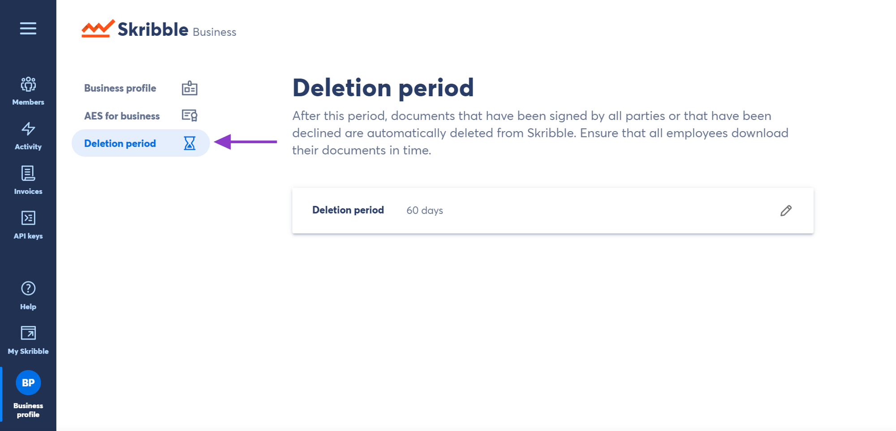
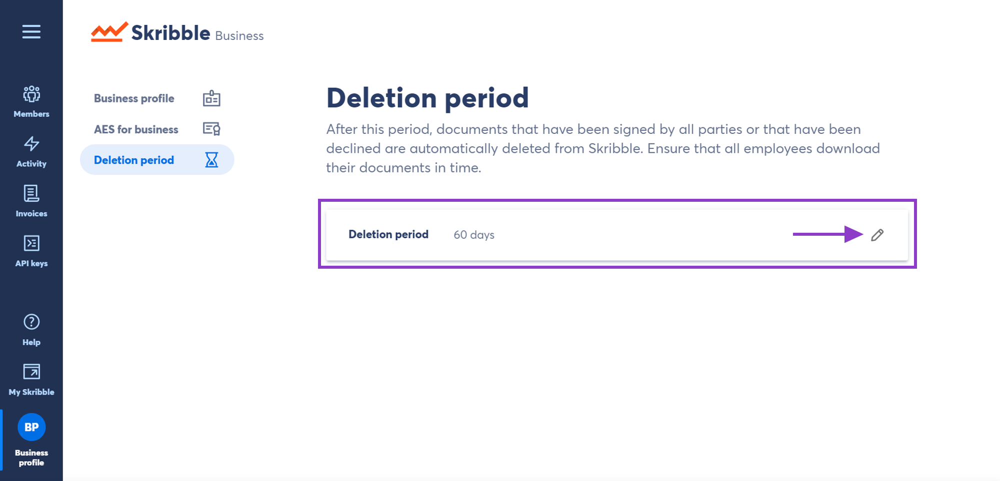
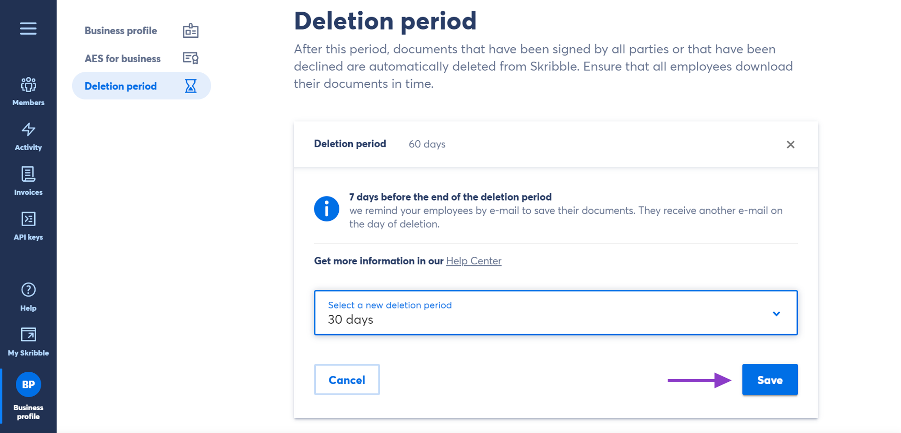

.. _account-deletionperiod:

==================================
Setting a Document Deletion Period
==================================

.. NOTE::
   This article describes a feature that is only available to Skribble Enterprise customers.

Documents that have been signed or declined by all parties will automatically and irrevocably be deleted from Skribble after 30 days (unless otherwise specified). As an administrator, you can customise document deletion period for your company and set it to 5, 10, 30, 60 or 90 days. Setting a new deletion period will apply it to all Skribble accounts and members associated with your Skribble Business.

To set a new deletion period:

- Click **Business profile** if you're not already there

.. image:: deletion_period_click_profile1.png
    :class: with-shadow
    
    
- Go to **Deletion period**

    

- Click the pen icon on the right and select the new deletion period from the drop-down menu

You'll be able to choose between 5, 10, 30, 60 and 90 days.

    
    
- Click **Save** to confirm

    
    
**E-mail notifications**

We will send an e-mail reminder to all members associated with your Skribble Business one week before the deletion period of a specific document expires. Additionally, we will send a final e-mail reminder on the day of deletion. We highly recommend that you inform all members when you set a new deletion period to ensure they can download their documents in good time.

If the document deletion period is set to **5 days**, we will send an e-mail reminder in the morning of the expiration date.

Should you have any questions or require further assistance, please drop us an e-mail at `support@skribble.com`_.
   
   .. _support@skribble.com: support@skribble.com
