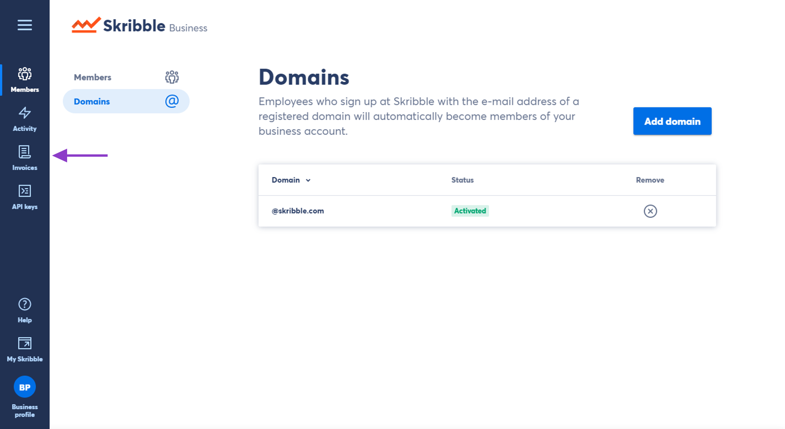
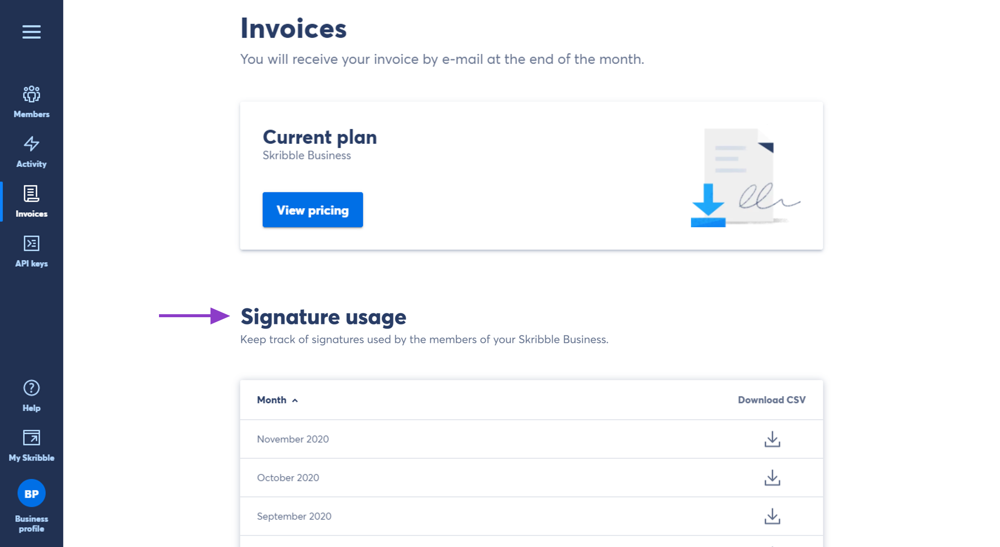
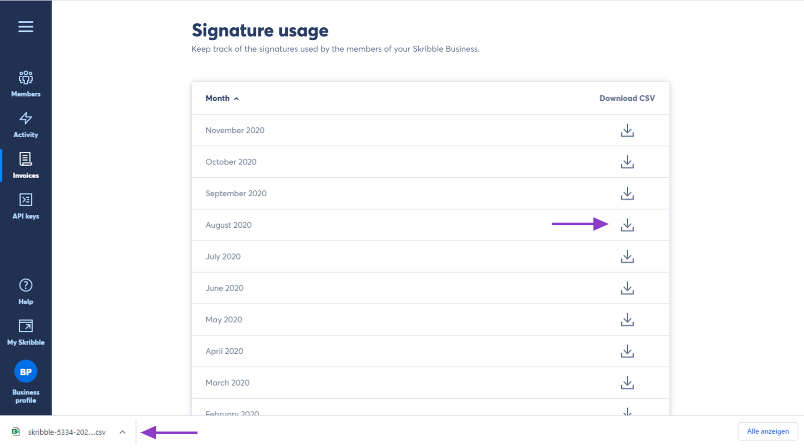
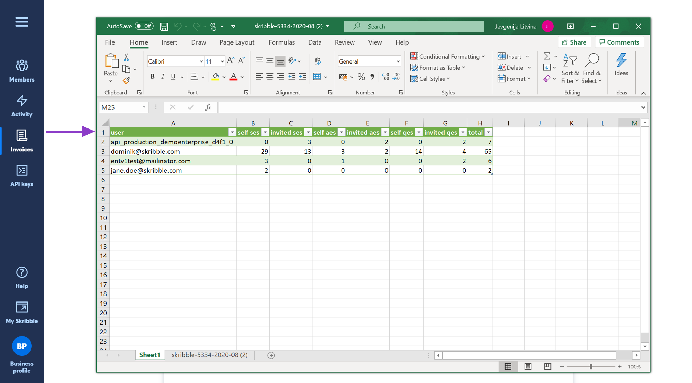

.. _account-signatureusage:

==================================
Downloading Signature Usage Report
==================================

As an admin of Skribble Business and Skribble Enterprise, you can download a monthly signature usage report. Signature reports are available in CSV format and help you to keep track of signatures used by the members of your business for each calendar month. 

From your **Business profile**:

- Click **Invoices** on the left-hand side

- Navigate to **Signature usage**

- Click the **Download icon** on the right of a calendar month (the CSV will be downloaded to your computer)

- Open the CSV document

**Understanding the signature report**

The CSV document will contain the following information:
  - **User** – member's e-mail address or an API
  - **Cost centre** –  cost centre within your business (available only to Skribble Enterprise customers with an active single sign-on). Tthis column will be empty if not specified by your company).
  - **Self SES, AES and QES** – number of signatures made by members
  - **Invited SES, AES and QES** – number of signatures made by the signatories who were invited to sign by the members of your Skribble Business

.. NOTE::
  If you want to assign a cost centre to a member of your business and display it in a CSV document, we kindly ask you to get in touch with our team at support@skribble.com. We will be happy to assist you.
