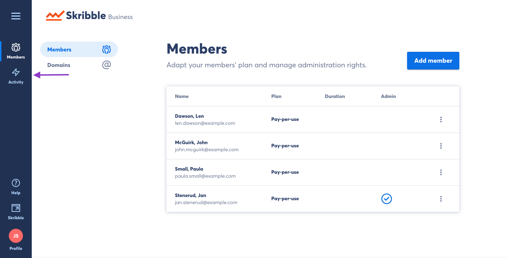
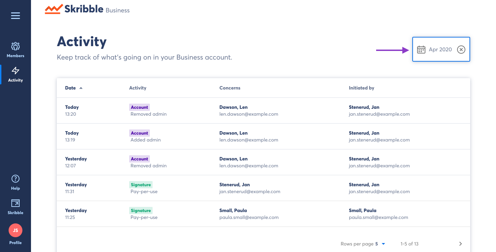
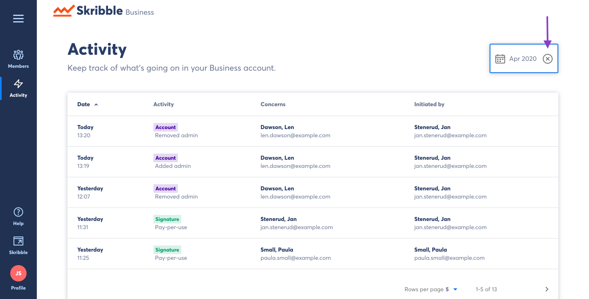
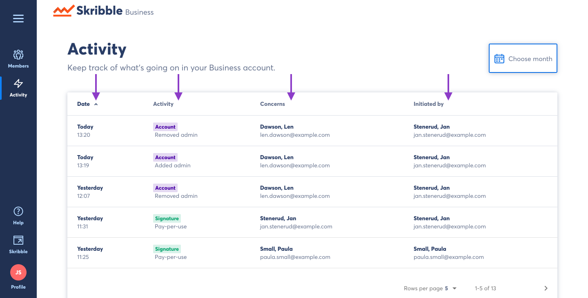
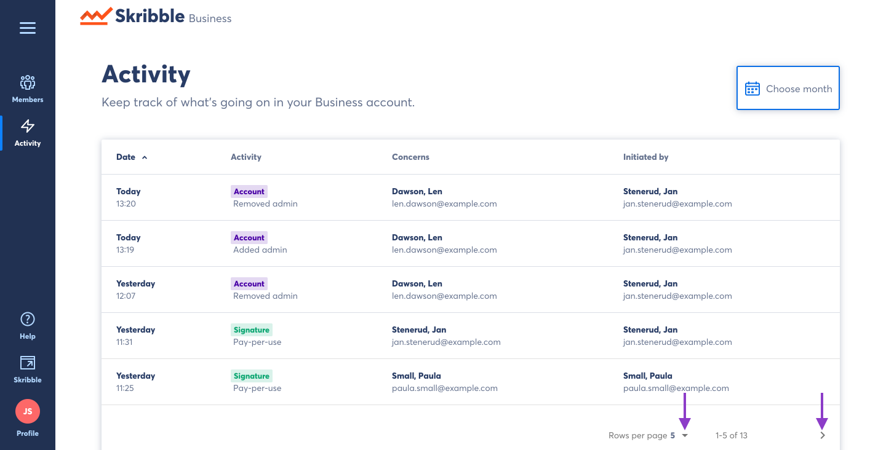

.. _monitor-account:

===================
Monitoring Activity
===================

-  Click **Activity** on the left-side menu

By default, this page will show all activity during the current calendar month.

- To select a past month, click the calendar icon and navigate the calendar tool

.. image:: usage_calendar.png
    :class: with-shadow

To see all activity since setting up your Skribble Business:

- Click the "X" next to the month/year

|
|

You can sort the information by:
  - Date
  - Activity
  - Concerns
  - Initiated by
  - Billable

Clicking on any of the category titles will sort the rows by that information.

You can also modify the number of rows shown per page by clicking the icon seen here:

|
