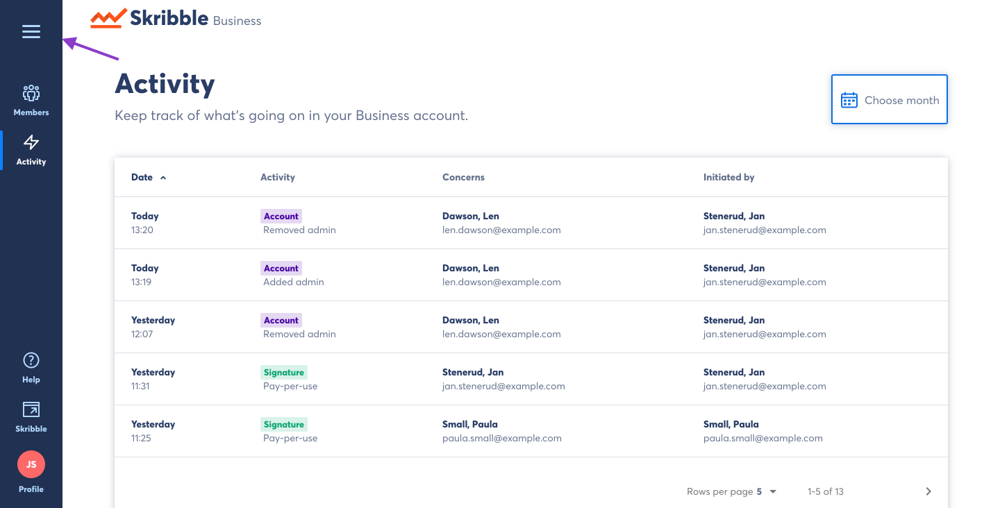
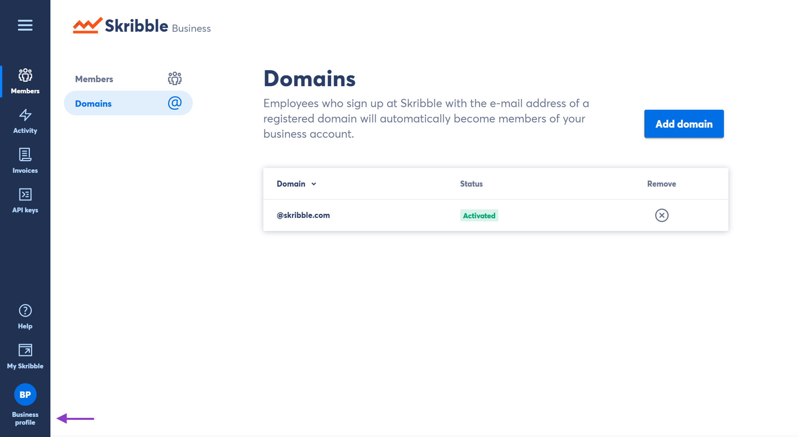
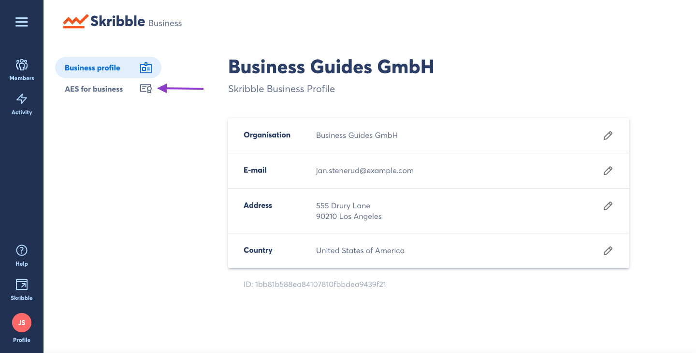
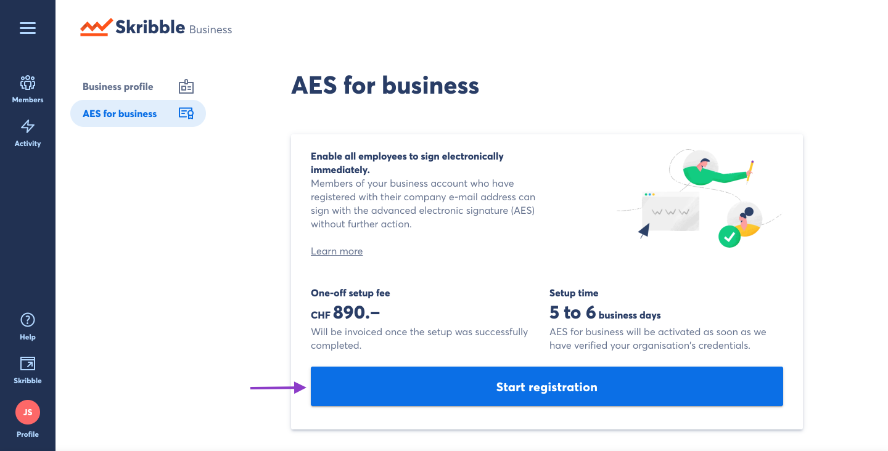

.. _aes-setup:

===========================
Setting up AES for Business
===========================

To complete registration for AES for Business, you will need to provide the following information:
  - Domain which should enable signing with AES (e.g. yourcompany.com)
  - Trade register number of your organisation
  - Name and e-mail address of an internal contact person

Please note that registering a domain incurs a one-time setup fee. Pricing is shown during the registration process described below.

Registering your company for AES for Business
---------------------------------------------

- From your Skribble Business, click the menu button in the top left of the page

- Click **Business profile**

- Click **AES for business**

Here you will find basic information about the setup process.

- Click **Start registration**

You will be taken to a form to provide information necessary to register for AES for Business. Once the form is submitted, the AES for Business registration has been initialized.
