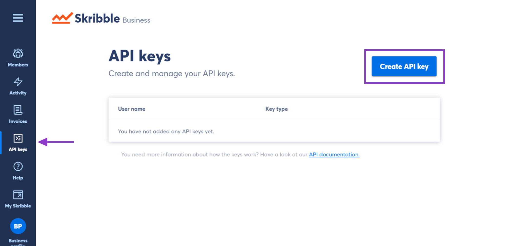
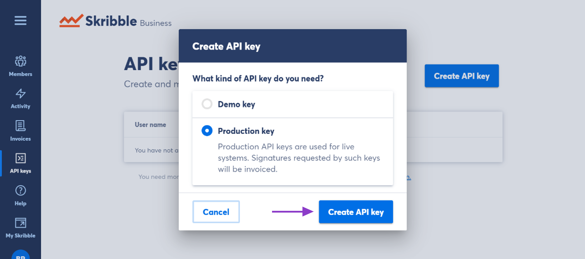
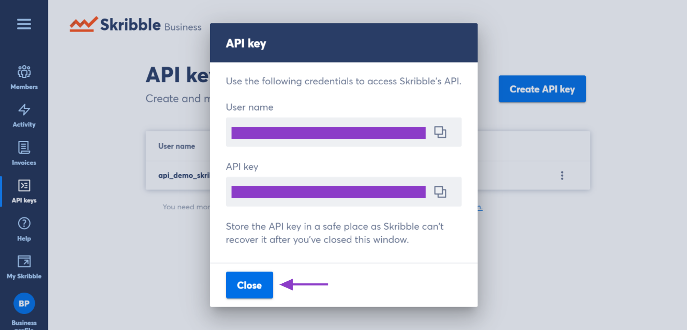
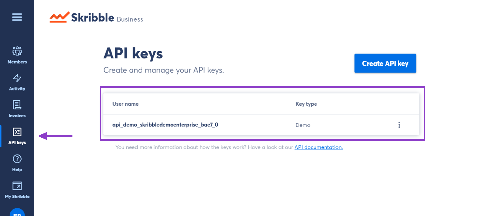
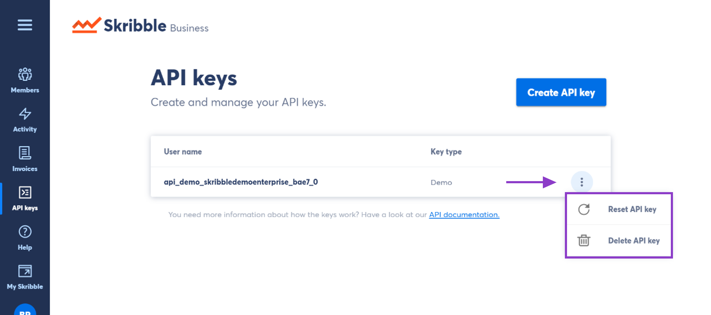

.. _api-create:

==============================
Creating and Managing API Keys
==============================

As a company, you can integrate Skribble with your existing infrastructure (e.g. CRM or SAP) via API. The API connection enables employees in your company to request and manage electronic signatures and documents directly from the systems they already use. They can invite external stakeholders or contracting parties to sign documents without creating a Skribble account. 

As a Skribble Business admin, you can generate and manage API keys for your company.  

For more information on using API keys, please visit our `API documentation`_.

  .. _API documentation: https://api-doc.skribble.com/
  
  
Creating an API key
-------------------

- Navigate to **API keys** if you aren't already there and click **Create API key** at the top right

You'll be able to choose between two types of keys:
  - **Demo API keys** are for testing and development purposes. Signatures requested by such keys don't have any legal weight and are free of charge. The signing process works without 2FA.
  - **Production API keys** are used for live systems. Signatures requested by such keys will be invoiced. All costs of signature requests created with your API key will be charged to your business. 

- Select the key you want to create and click **Create API key**

In the next step, you will be able to view the API key (this is your password) along with your username.

.. NOTE::
  Please note that the API key is your password and should be stored in a safe place. Skribble won't be able to recover it after you've closed the window.

Resetting or deleting an API key
--------------------------------

As a Skribble Business admin, you can reset or delete the existing API keys.

- Navigate to **API keys** if you aren't already there 

Clicking the three vertical dots next to the API key will open a window with two options:
  - **Resetting the API key** is irreversible and will disable all the existing integrations with this key until the new API key is in place. Clicking **Reset API key** will generate a new key.
  - **Deleting the API key** will remove all existing integrations irreversibly.

If you have problems generating or managing your API keys just drop us an e-mail at `support@skribble.com`_.  

  .. _support@skribble.com: support@skribble.com
