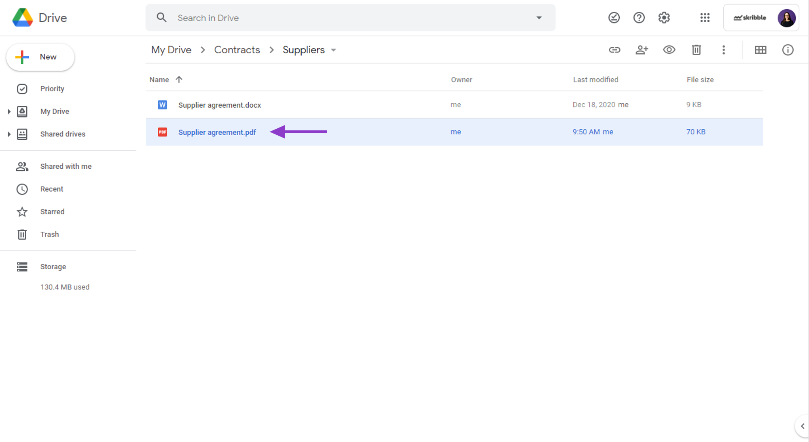
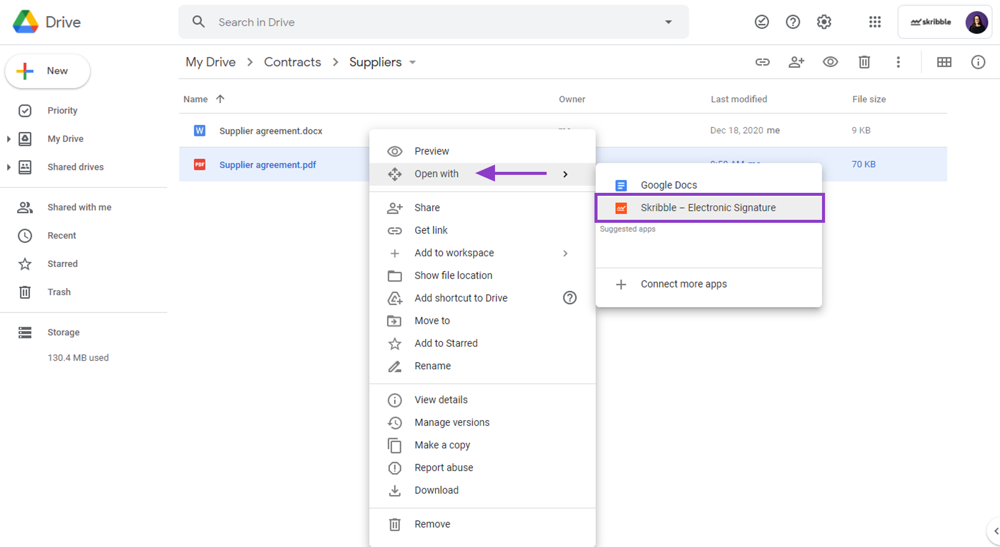
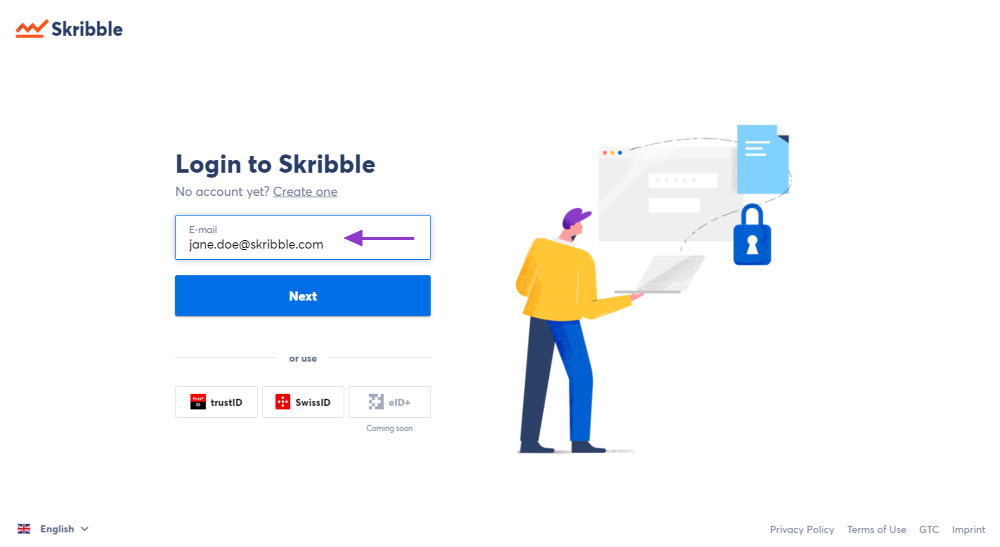
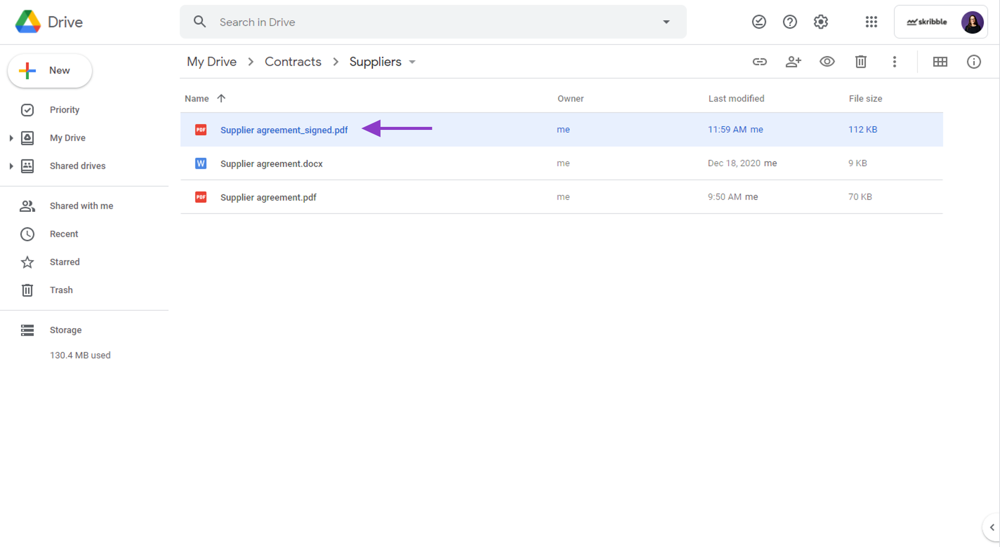

.. _sign-google-drive:

===================================
Signing documents from Google Drive
===================================

.. NOTE::
  This is a beta feature available to a limited group of Skribble Business customers.
  
Once your Google Drive admin connects your company's Skribble Business with Google Drive, you'll be able to sign with Skribble directly from your Google Drive Web App (not the local version on your computer).

To sign a document from Google Drive (video tutorial available `here`_):

.. _here: https://youtu.be/zKqAU9ke46I

- Go to Google Drive Web App at `drive.google.com/drive`_

.. _drive.google.com/drive: https://drive.google.com/drive

If you're not logged in yet, please make sure to log in with the same e-mail address you use to log in to your Skribble account.

- **Right-click** on the document you want to sign

    

- Click **Open with** and select **Skribble Electronic Signature** from the list

If you don't see Skribble Electronic Signature after right-clicking on the document, please get in touch with your Google Drive admin.

    

- **Log in** with your **Skribble account** and sign the document or invite others to sign the usual way

    
    
- After all invited parties have signed the document, it will automatically be saved next to the original document in your Google Drive

    
    
