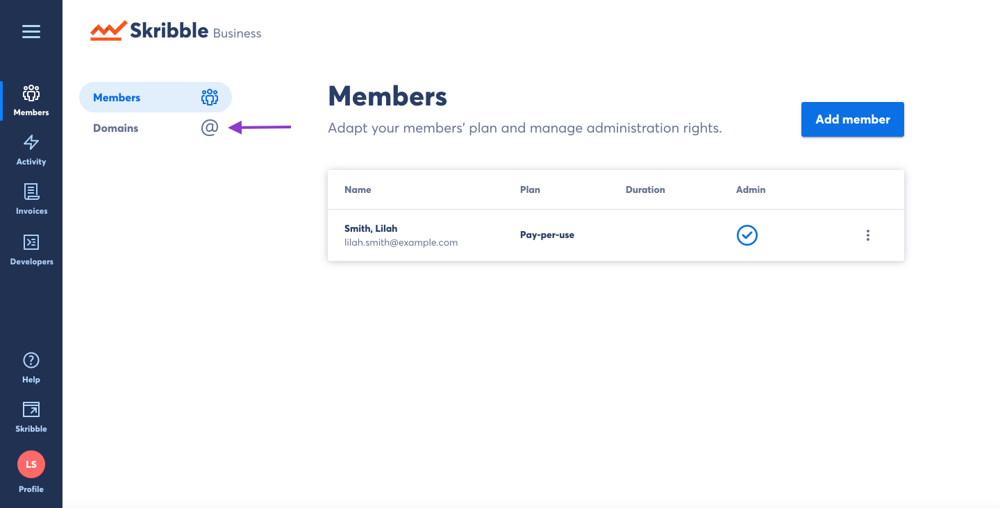
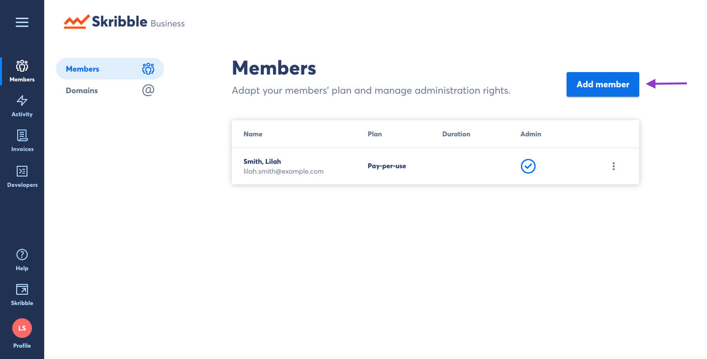

.. _adding-members:

========================================
Adding Members to your Skribble Business
========================================

There are two ways to add members to your Skribble Business:

- By domain (whitelisting)
- By e-mail

The simplest way to add multiple members to your Skribble Business is by registering your company domain (@example.org). Once this is complete, anyone who creates a new Skribble account using your company domain will automatically become a member of your Skribble Busines.

.. NOTE::
  Employees of your company who created a Skribble account *before* your domain was registered with your Skribble Busines will not be added automatically to your account. You will need to add them by e-mail invite, described in the next section.
  
  
Adding members by domain
-------------------------

- Click **Members** if you aren't already there

.. image:: adding_members.png
    :class: with-shadow

- Click **Domains**

- Click **Add domain**

.. image:: adding_domains.png
    :class: with-shadow

- Enter your domain in the text field and click **Add**

.. image:: adding_add.png
    :class: with-shadow

Now you can see the status of the domain you've requested.

.. image:: adding_requested.png
    :class: with-shadow

Adding members by e-mail
-------------------------

The other way to add members to your Skribble Business is by e-mail:

.. NOTE::
   The person must already have a Skribble account before they can be added to your Skribble Business.

- Click **Members** if you aren't already there

.. image:: adding_members.png
    :class: with-shadow

- Click **Add Member**

- Type the e-mail address of the person you wish to add to your Skribble Business. You can add multiple e-mails by separating them with a comma. Once you are finished adding e-mails to the text box, click **Add**.

.. image:: adding_address.png
    :class: with-shadow

If the recipient has a Skribble account, they will now be added to your Skribble Business.
