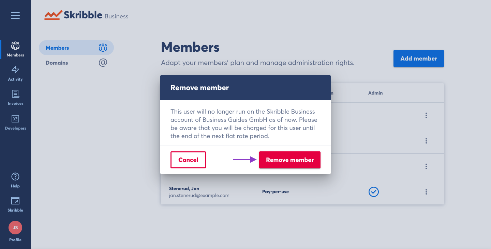

.. _removing-members:

=======================================
Removing Members from Skribble Business
=======================================

.. NOTE::
   Removing a member from Skribble Business will downgrade the member's plan to **Skribble Free**. 
   

- Click **Members** if you aren't already there

.. image:: adding_members.png
    :class: with-shadow

On the **Members** page you will see a list of all members of your Skribble Business.

- Click the three vertical dots to the right of the member to see available actions

.. image:: removing_members.png
    :class: with-shadow

- Click **Remove member**

.. image:: removing_options.png
    :class: with-shadow

The system will explain the consequences of removing the member.

- Click **Remove member** to confirm your decision

