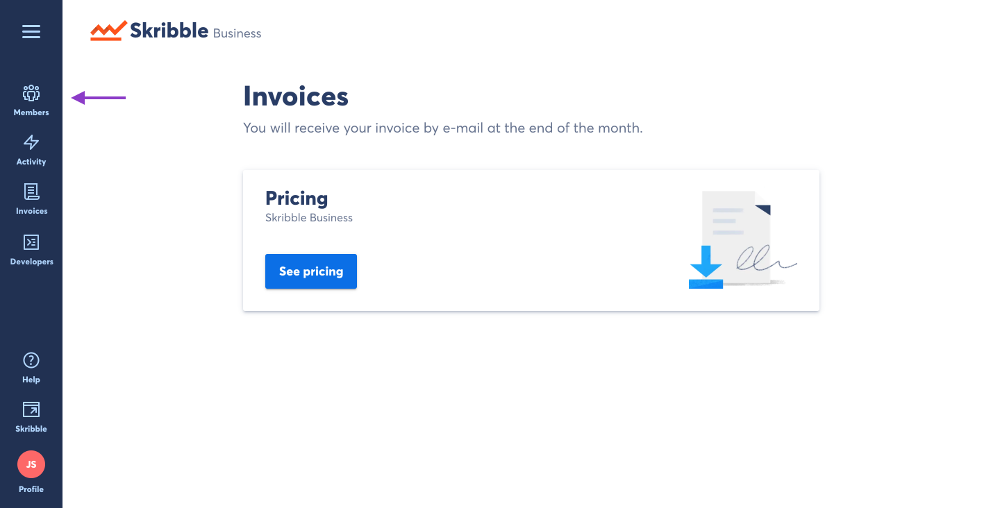
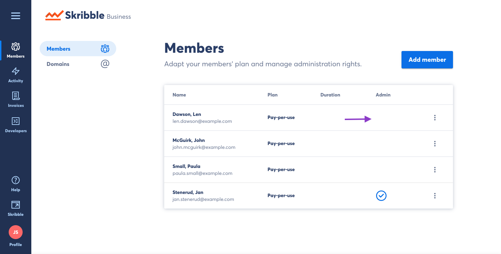

.. _revoke-admin:

===================
Revoking Admin Role
===================

- Click **Members** if you aren't already there

On the **Members** page you will see a list of all members of your Skribble Business.

- Click the three vertical dots to the right of the member to see available actions

.. image:: revoking_members.png
    :class: with-shadow

- Click **Revoke admin role**

.. image:: revoking_options.png
    :class: with-shadow

This user will still be a member of your Skribble Business, but will no longer have access to admin functions.

