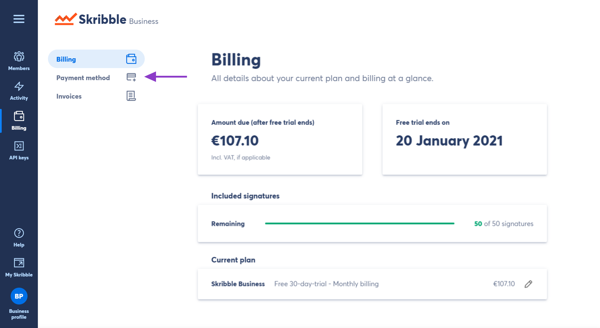
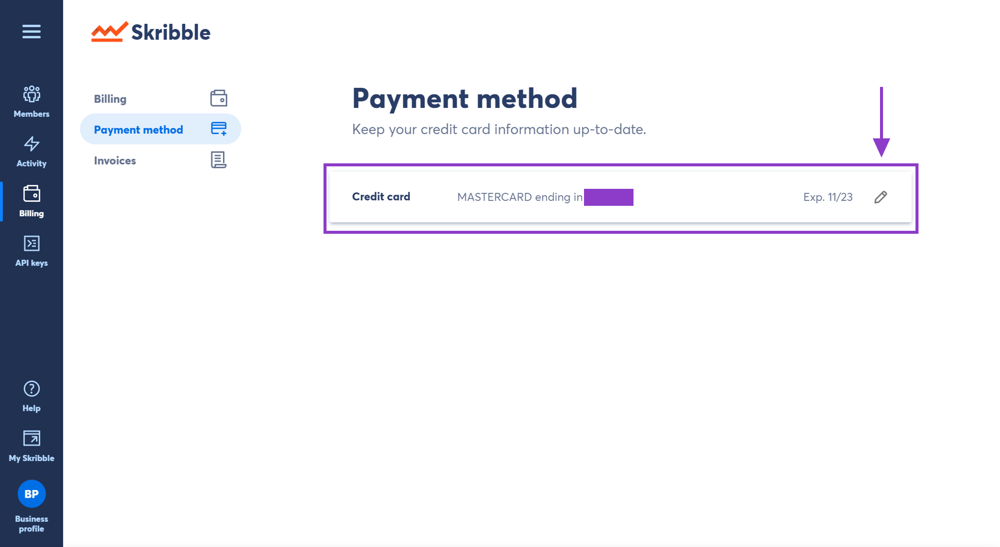
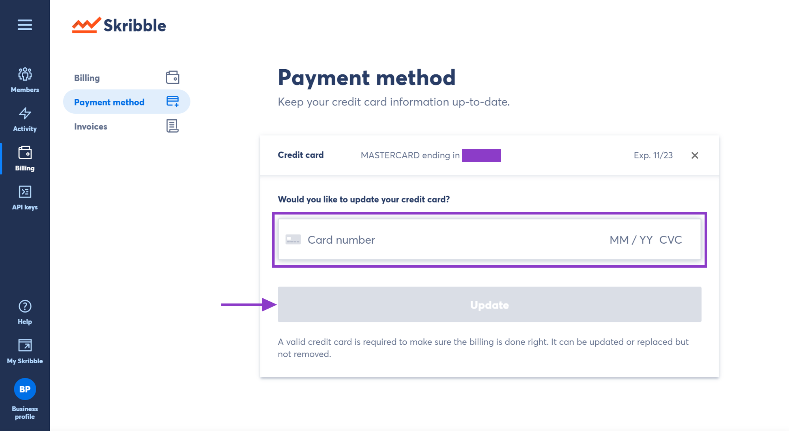

.. _quickstart-paymentmethod:

=======================
Updating Payment Method
=======================
 
 
.. NOTE::
   Your credit card can be updated or replaced, but not removed. 
   
   
To update your credit card information:

- Go to your **Business profile** if you’re not already there

.. image:: step_1_go_business.png
    :class: with-shadow

- Click **Billing** 

.. image:: step_2_billing.png
    :class: with-shadow
    

- Navigate to **Payment method**

    

- Click the **pencil icon** to update the information

    

- Then click **Update** to confirm changes

   
