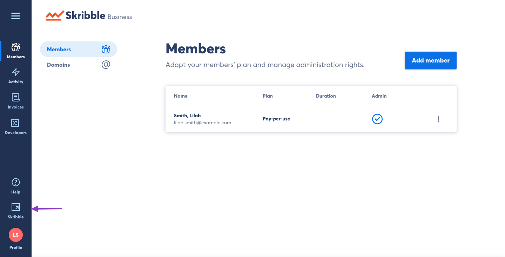
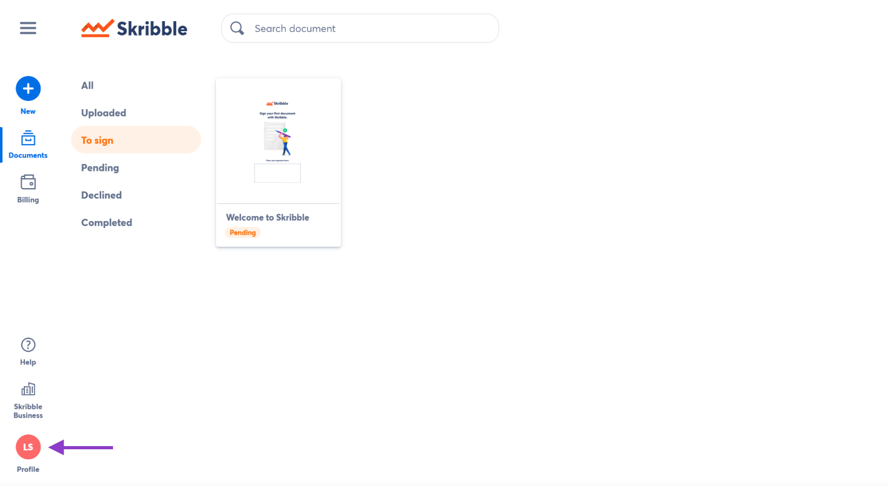

.. _quickstart-signature:

==============================================
Customising Visual Signatures
==============================================

.. NOTE::
   This article describes a feature that is only available to Skribble Business and Enterprise customers. For more information, see `Price plans`_.

   .. _Price plans: https://www.skribble.com/pricing/

With Skribble, you can keep the look and feel of your handwritten signature when signing electronically. The visual signature customiser allows you to create your personal visual signature and customise its appearance. When you sign a document with Skribble, your visual signature will be displayed on the signed document.

To customise your personal visual signature, you will have to switch to My Skribble first:

- From your Skribble Business dashboard, click the **My Skribble** icon in the lower left of the menu

- Click **Profile** in the bottom left

- Click **Visual signature**

.. image:: 3-click_visual_signature.png
    :class: with-shadow

- Click **Upload image** and select your handwritten signature as a PNG, JPG or GIF

**Tip**: For optimal resolution, we recommend that you write your signature on a sheet of A4 paper in the ratio of 1:4 and scan it with your scanner.

.. image:: 4-upload_visual_signature.png
    :class: with-shadow

**Tip**: If you log in to your Skribble account via smartphone, you can directly take a picture of your signature via smartphone camera.

From here, you can customise the following details:
  - **Name**: Your first and last name
  - **Optional line** and **City**: Optional fields for any additional information (e.g. organisation, function or name)
  - **Date**: Date when the document was signed
  - **QR code**: Contains additional information about the e-signature standards
  - **Clam and label**: "Signed with Skribble.com" claim along with the e-signature standard used
  
  
.. image:: 5-customise_visual_signature.png
    :class: with-shadow
    
    
To customise your visual signature:

- Update the information you want to be displayed on your visual signature and click **Save** to confirm

.. image:: 6-save_customisation.png
    :class: with-shadow

.. NOTE::
   If any of these customisation options are not visible in your account, your current price plan might not support it. Please contact our support team for assistance: support@skribble.com
   
