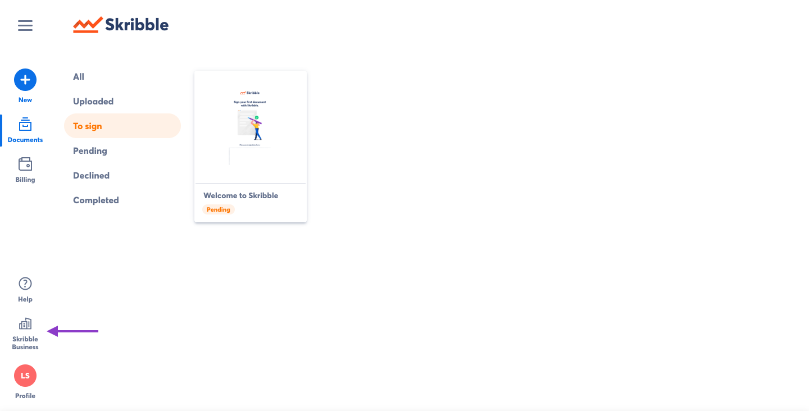
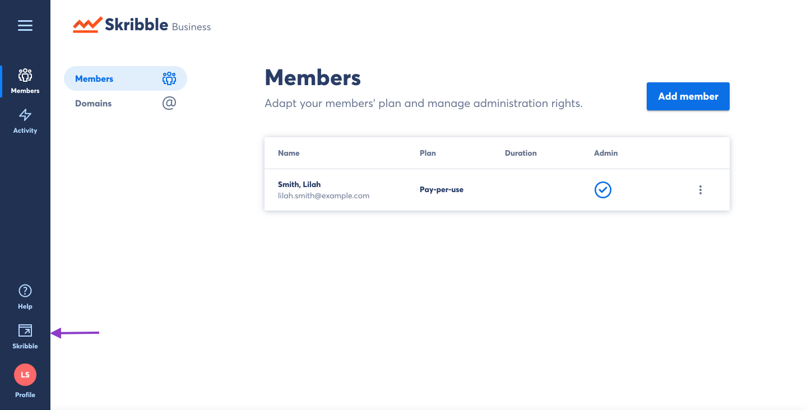

===============================================
Toggling between Skribble and Skribble Business
===============================================
Skribble makes it easy to switch back-and-forth between signing documents and managing your Skribble Business Account.

To manage your Skribble Business Account:

- From your Skribble account, click the **Skribble Business** icon in the lower left of the menu panel

Here you can access administrative functions for your Skribble Business Account.

To get back to sending and signing documents:

- Click the **Skribble** icon in the lower left of the menu panel

Use the toggle button to quickly shift between using Skribble and managing your Skribble Business users.
