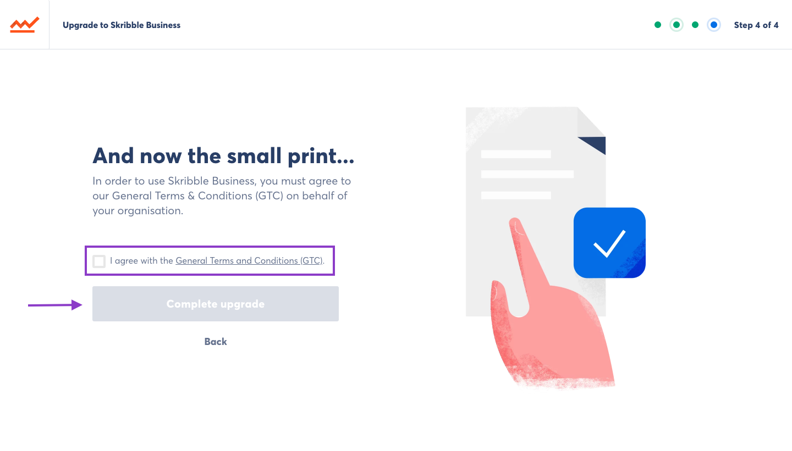

.. _upgrade-to-business:

====================================
Creating a Skribble Business Account
====================================
If you do not have a Skribble account, please create one at `skribble.com`_:

.. _skribble.com: https://my.skribble.com/signup

To upgrade your account to Skribble Business:

- Log in to your Skribble Account at https://my.skribble.com/

- Click the menu button in the top left

.. image:: upgrade_menu.png
    :alt: pointer to menu button
    :class: with-shadow

- Click **Upgrade Now** under "Skribble Business"

.. image:: upgrade_button.png
    :class: with-shadow

On the following page you will see a brief description of Skribble Business.

- To upgrade, click **Upgrade now**

.. image:: upgrade_launch.png
    :class: with-shadow

- Enter the exact, legal name of your organisation and click **Continue**

.. image:: upgrade_step1.png
    :class: with-shadow

- Enter the address of your organisation and click **Continue**

.. image:: upgrade_step2.png
    :class: with-shadow

- Choose your billing period and click **Continue**

.. image:: upgrade_step3.png
    :class: with-shadow

- Read the General Terms & Conditions on the third page of registration. If you agree, click the box next to "I agree with the General Terms and Conditions (GTC)", then click **Complete upgrade**

Congratulations, your account has been upgraded to Skribble Business! Click **Start now** to begin managing your organisation.

.. image:: upgrade_welcome.png
    :class: with-shadow
