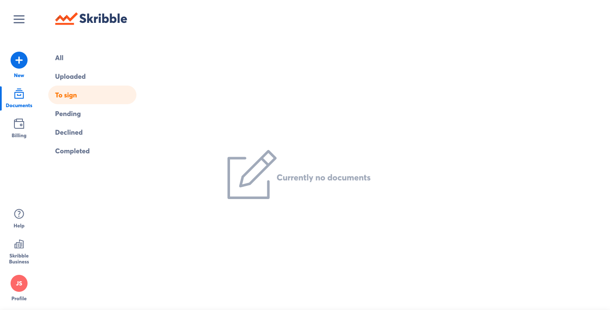
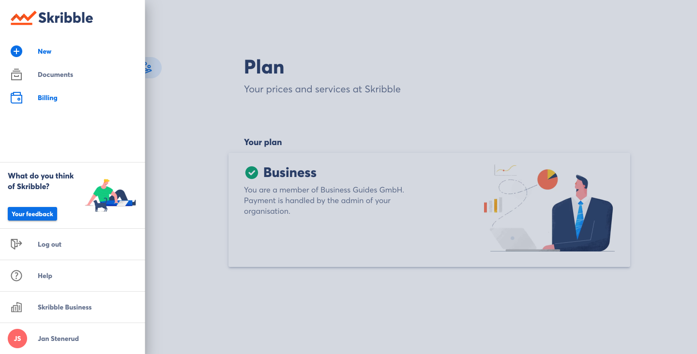
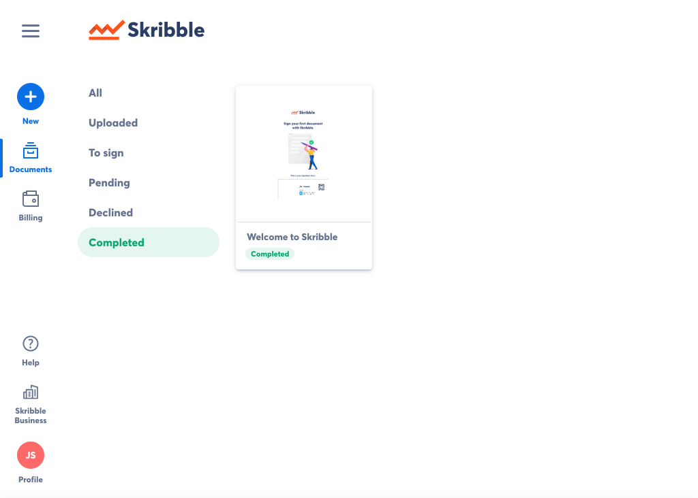

==================================
Upgrading to Skribble for Business
==================================
If you do not have a Skribble account, please refer to our *guide* for creating an account.

To upgrade your account to Skribble Business:

- Log in to your Skribble Account at https://my.skribble.com/

- Click the menu button in the top left

.. figure:: upgrade_menu.png
    :alt: pointer to menu button
    :class: with-shadow
    :figclass: align-center

Here is some test text. Should not be a caption.

.. image:: upgrade_button.png
    :class: with-shadow

.. image:: ipad_test.png
    :class: with-shadow

- Click **Upgrade Now** under "Skribble Business"

*image*

On the following page you will see a brief description of Skribble Business.

- To upgrade, click **Upgrade now**

*image*

- Enter the exact, legal name of your organisation on the first page of registration

*image*

- Enter the address of your organisation on the second page of registration.

*image*

- Read the General Terms & Conditions on the third page of registration. If you agree, click the box next to "I agree with the General Terms and Conditions (GTC)", then click **Complete upgrade**

*image*

Congratulations, your account has been upgraded to Skribble Business! Click **Start now** to begin managing your organisation.
