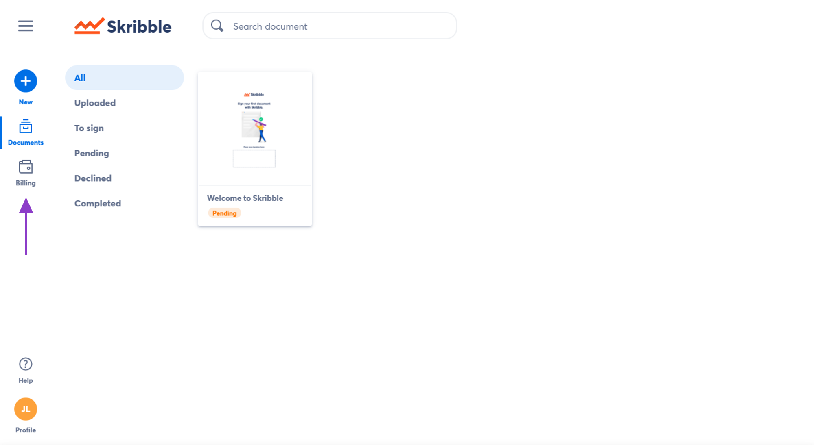
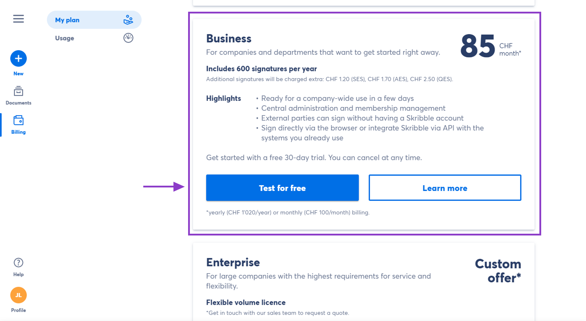
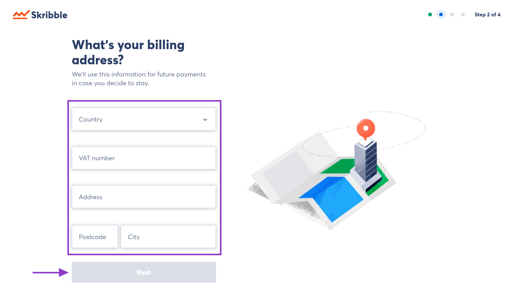
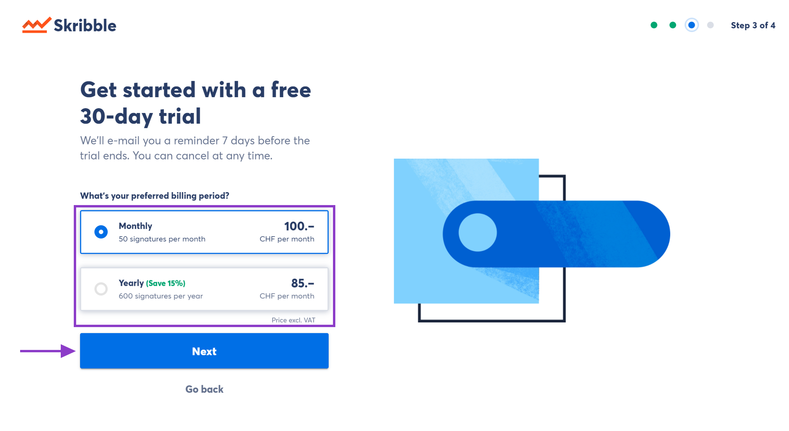
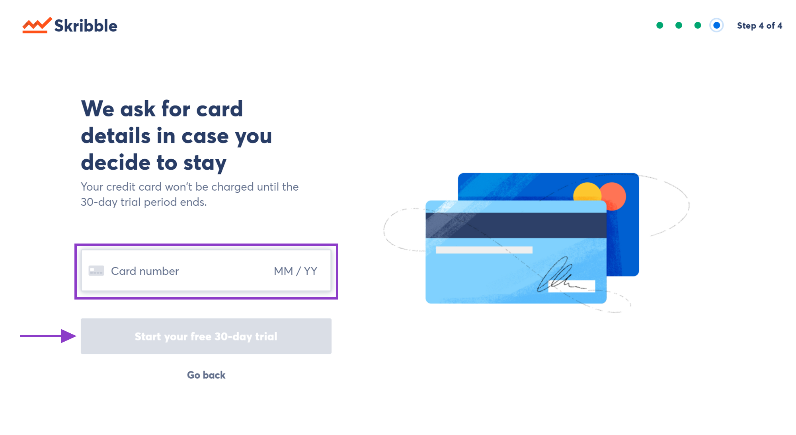
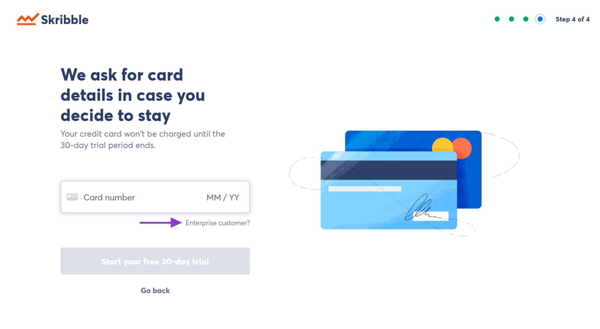

.. _upgrade-to-business:

============================
Setting up Skribble Business
============================

.. NOTE::
  You’ll need a Skribble account to set up Skribble Business for your company. You can create one at `skribble.com`_ if you don’t have one yet. 

.. _skribble.com: https://my.skribble.com/signup

Skribble offers a free trial month to new customers. You won’t be charged during the free trial, and you can cancel at any time.

To set up Skribble Business and start your free trial:

- Log in to your Skribble account at `my.skribble.com`_

.. _my.skribble.com: https://my.skribble.com/

- Go to **Billing** 

On the next page, you’ll see the details of the price plans available at Skribble.

- Navigate to **Skribble Business** and click **Test for free**

- Enter your full and exact company name and read our General Terms & Conditions

If you accept the terms, click the box next to "I agree to the General Terms and Conditions of Skribble on behalf of my company", and then click **Next** 

- Enter your company’s billing address and click **Next**

- Choose your preferred billing period and click **Next**

    

- Enter your credit card details and click **Start your free 30-day trial**

.. NOTE::
   Your credit card won’t be charged until the trial period expires.
   

    

**Are you an Enterprise customer?**

- Click **Enterprise customer?**

In the next step, you'll be able to enter your access code.

Congratulations, you can now test Skribble Business for free for 30 days. Click **Add new members** to add your team members and enable them to sign electronically.

    
