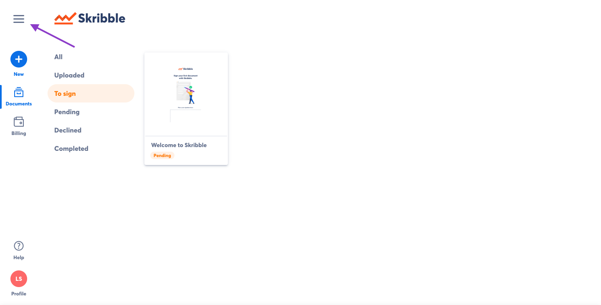
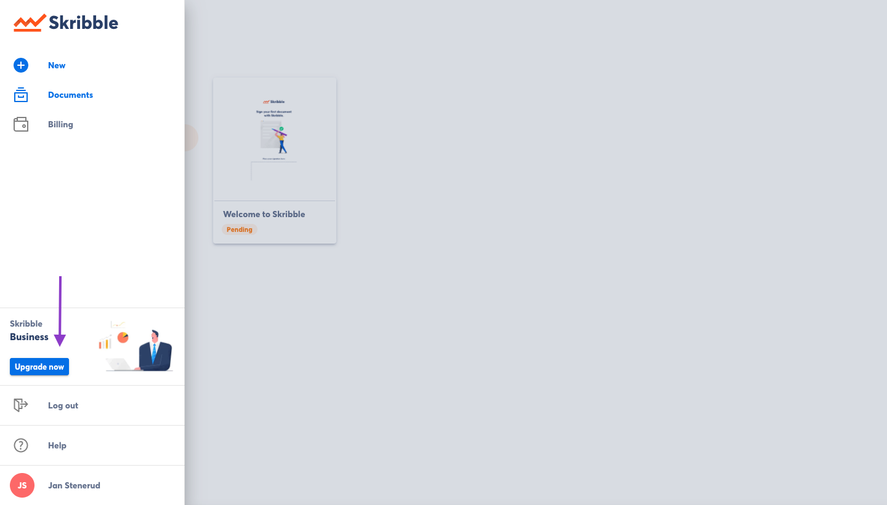
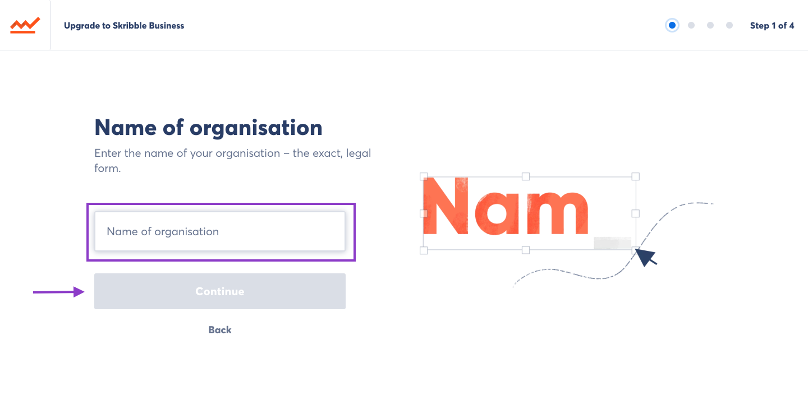
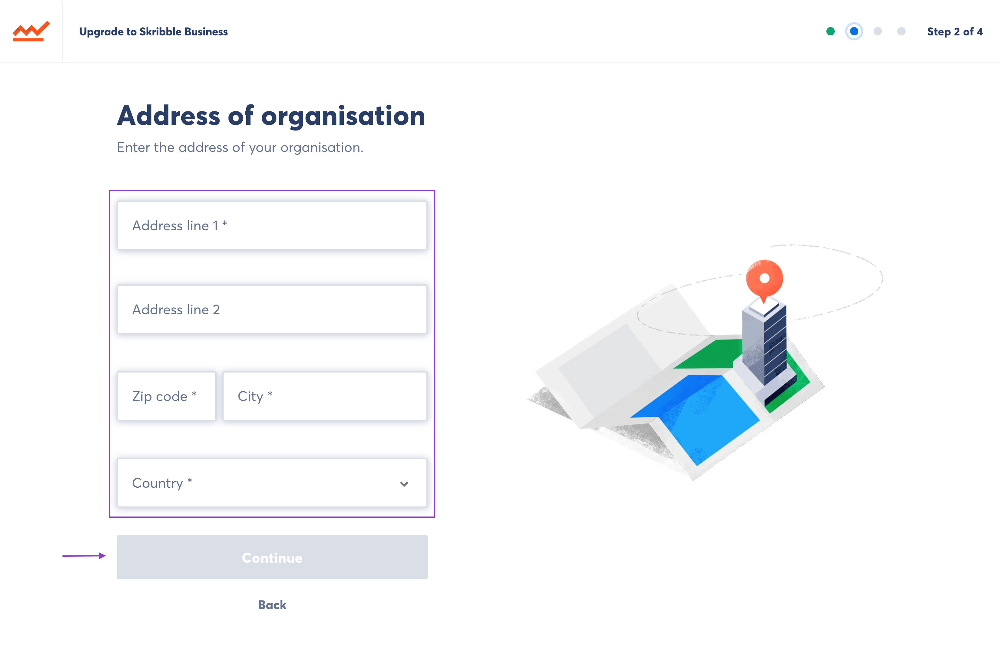
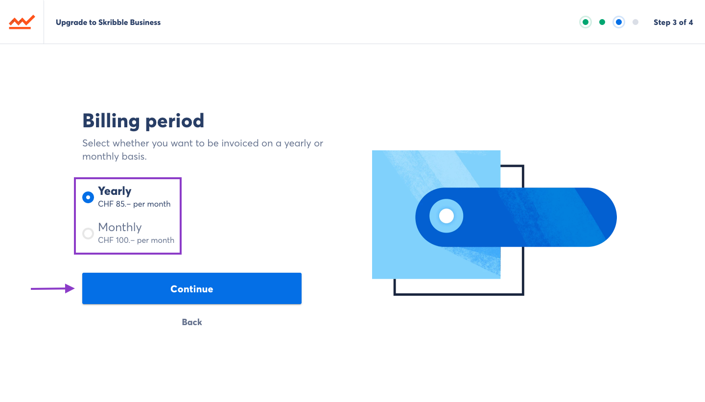
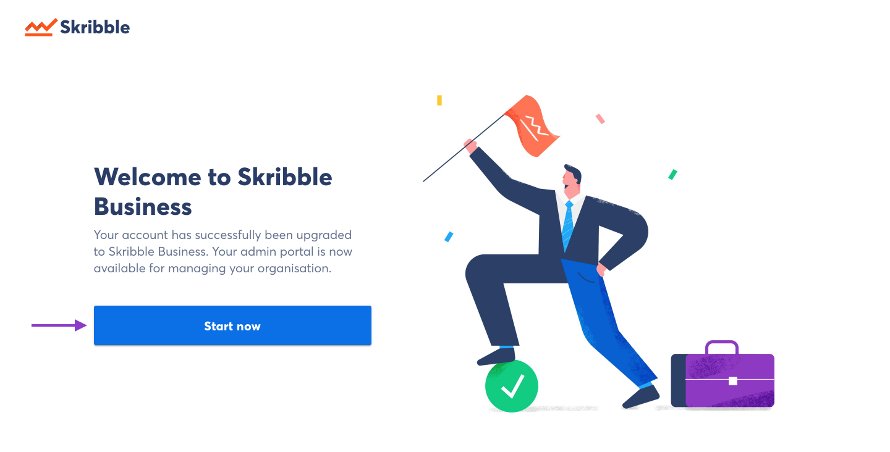

.. _upgrade-to-business:

============================
Setting up Skribble Business
============================

.. NOTE::
  To set up Skribble Business for your company, you’ll need a Skribble account. You can create one at `skribble.com`_ if you don’t have one yet. 

.. _skribble.com: https://my.skribble.com/signup

To set up Skribble Business for your company:

- Log in to your Skribble account at https://my.skribble.com/

- Click the menu button in the top left

- Click **Try for free** under "Skribble Business"
  
  

On the following page you will see a brief description of Skribble Business.

.. NOTE::
  You’ll be able to get started with a free trial and test Skribble for 30 days free of charge. 
  

- Click **Get started with a free 30-day trial** to start the trial period

- Enter your full and exact company name and click **Next**

- Enter your company’s billing address and click **Next**

- Choose your preferred billing period and click **Next**

    
    
    .. NOTE::
  You’ll need a credit card to get started with your free trial. Your credit card won’t be charged until the trial period expires. You can cancel at any time.
  
  
    - Enter your credit card details and click **Next**

Congratulations, your free 30-day trial has started. You’ll receive an e-mail confirmation and a reminder 7 days before the free trial expires.

    
    To get the most out of your free trial, we recommend that you add your team members to your Skribble Business to enable them to sign electronically. Check out our `Quick Start Guide`_ for help. 
    

.. _Quick Start Guide: https://docs.skribble.com/business-admin/quickstart/onboard.html
