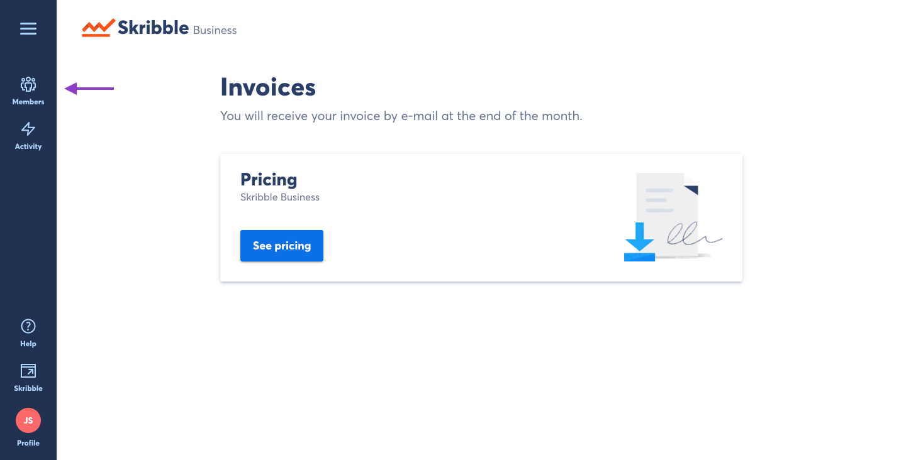
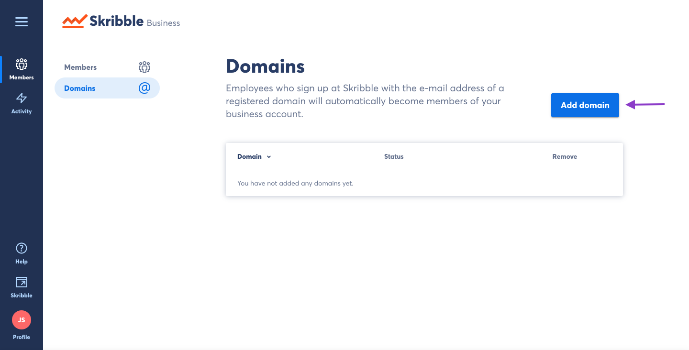
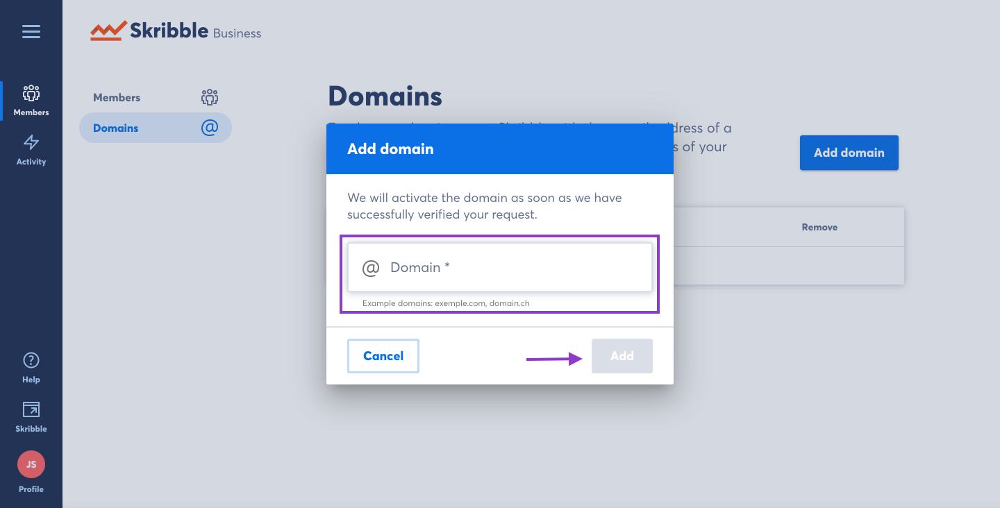
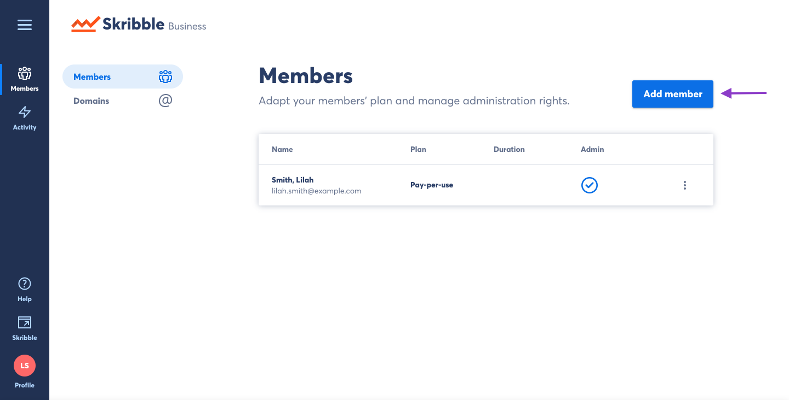
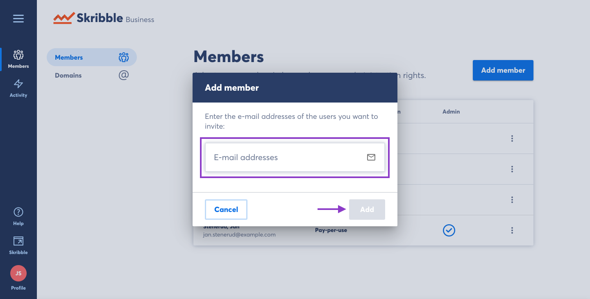

==============================================
Adding Users to your Skribble Business Account
==============================================

There are two ways to add users to your Skribble Business Account:

- By Domain (whitelisting)
- By e-mail

The simplest way to add multiple users to your Business Account is by registering your company domain (@example.org). Once this is complete, any user who creates a new Skribble account using your company domain will automatically be a part of your Business Account.

**Note:** Any users at your company who created a Skribble account *before* your domain was registered with your Business Account will not be added automatically to your account. You will need to add those users by e-mail invite, described in the next section.

To add users by domain:

- Click **Members** if you aren't already there

- Click **Domains**

- Click **Add domain**

- Enter your domain in the text field and click **Add**

Now you can see the status of the domain you've requested.

Adding users by e-mail:
-----------------------

The other way to add users to your Skribble Business Account is by email invite:

- Click **Members** if you aren't already there

-Click **Add Member**

- Type the email address of the user you wish to add to your Skribble Business account. You can add multiple emails by separating them with a comma. Once you are finished adding emails to the text box, click **Add**.

If the recipient has a Skribble account, they will now be added to your Skribble Business account.
