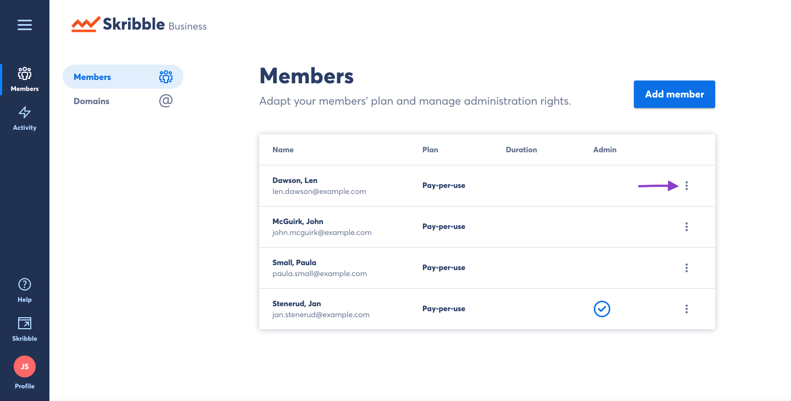
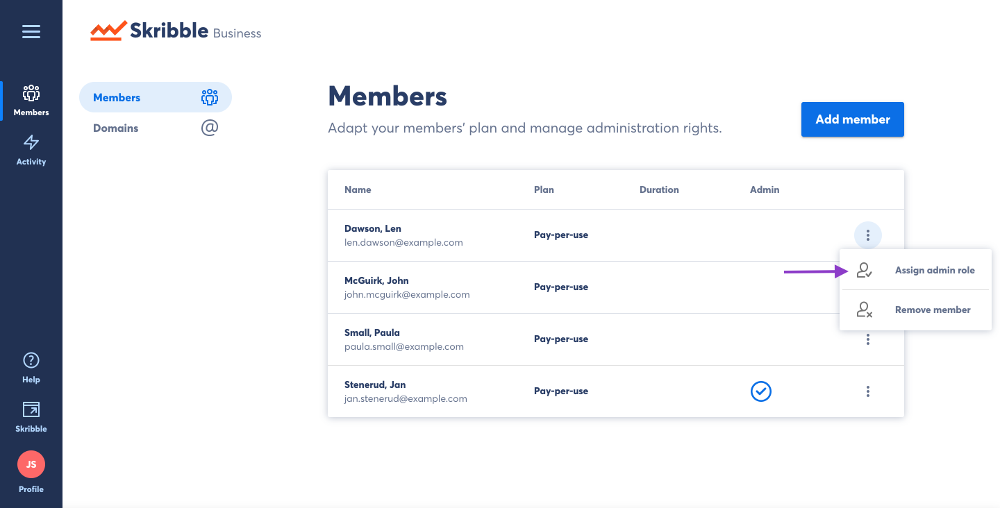

=====================
Granting Admin Status
=====================

- Click **Members** if you aren't already there

.. image:: adding_members.png
    :class: with-shadow

On the **Members** page you will see a list of all members of your Skribble Business Account.

- Click the options menu to see available actions for the selected user.

- Click **Assign admin role**

This user will now have access to administrative functions such as adding and removing members, monitoring the activity of other users, and granting or revoking the admin role of other users.

.. image:: granting_added.png
    :class: with-shadow
