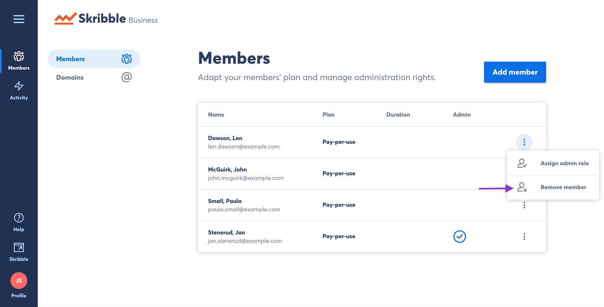
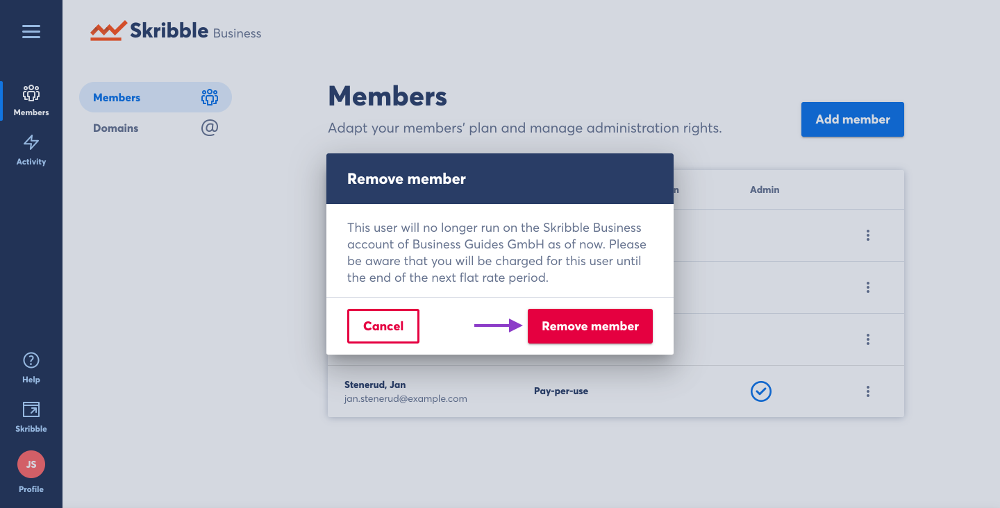

=========================================
Removing Users from your Business Account
=========================================

- Click **Members** if you aren't already there

.. image:: adding_members.png
    :class: with-shadow

On the **Members** page you will see a list of all members of your Skribble Business Account.

- Click the options menu to see available actions for the selected user.

.. image:: removing_members.png
    :class: with-shadow

- Click **Remove member**

The system will explain the consequences of removing the member. Click **Remove member** to confirm your decision.

