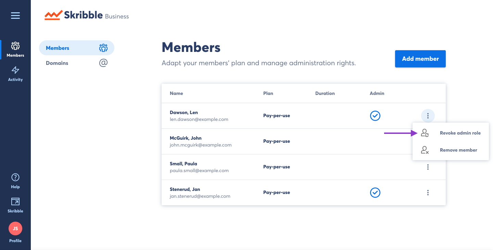
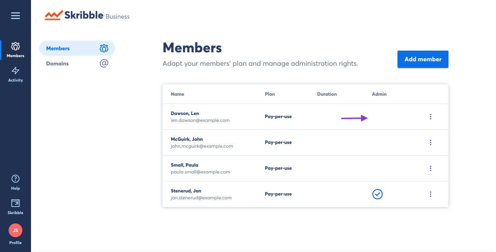

.. _revoke-admin:

=====================
Revoking Admin Status
=====================

- Click **Members** if you aren't already there

.. image:: adding_members.png
    :class: with-shadow

On the **Members** page you will see a list of all members of your Skribble Business Account.

- Click the options menu to see available actions for the selected user.

.. image:: revoking_members.png
    :class: with-shadow

- Click **Revoke admin role**

This user will still be a member of your business account but will no longer have access to administrative functions.

